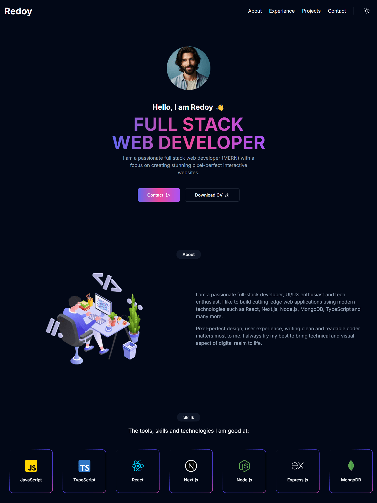

<h1 align="center">Developer Portfolio</h1>

<p>Are you struggling to create a professional portfolio website? Look no further! You can use the Developer Portfolio template and create your very own personalized portfolio today! This website is designed to be user-friendly and easily customizable, making it perfect for both developers and freelancers. This website was built using <a href="https://nextjs.org" target="_blank">Next.js</a>, <a href="https://tailwindcss.com" target="_blank">Tailwind CSS</a>, <a href="https://www.radix-ui.com" target="_blank">Radix UI</a>, <a href="https://ui.shadcn.com" target="_blank">shadcn/ui</a>
</p>

<div align="center">

</div>

## Tech Stack

-   [Next.js](https://nextjs.org) - React framework for building performant apps with the best developer experience
-   [TypeScript](https://typescriptlang.org) - Static type checker for end-to-end typesafety
-   [Tailwind CSS](https://tailwindcss.com) - Utility-first CSS framework for rapid UI development
-   [shadcn/ui](https://ui.shadcn.com/) - Reusable components built with Radix UI and Tailwind CSS for building modern UIs quickly
-   [Lucide Icons](https://lucide.dev) - Beautifully simple, pixel-perfect icons
-   [Next Themes](https://github.com/pacocoursey/next-themes) - An abstraction for themes (Dark + Light Mode).

## Running Locally

```bash
$ git clone https://github.com/imredoyyy/developer-portfolio.git
$ cd developer-portfolio
$ npm install
$ npm run dev
```

Open [http://localhost:3000](http://localhost:3000) with your browser to see the result.

## License

Licensed under the [MIT license](https://github.com/imredoyyy/developer-portfolio/blob/main/LICENSE).
